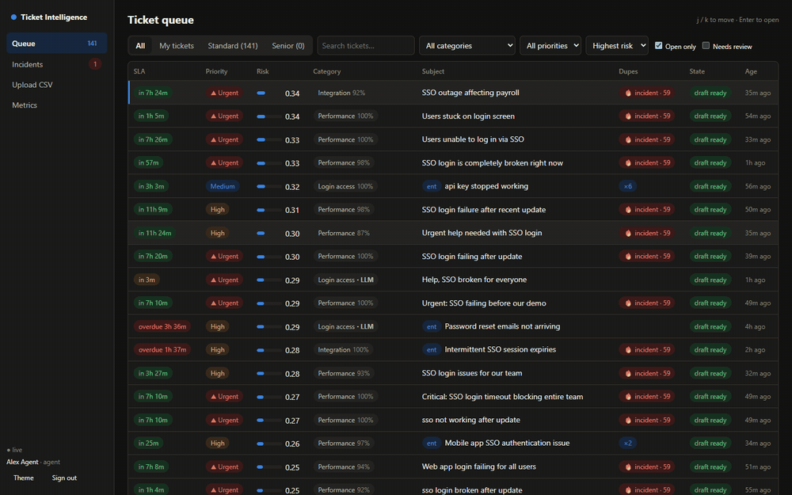
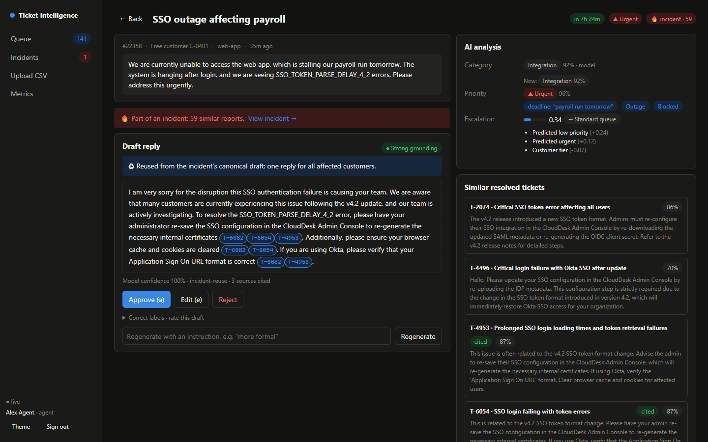
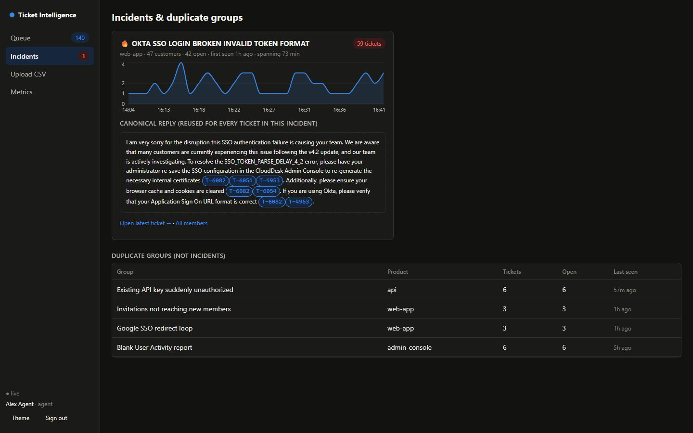
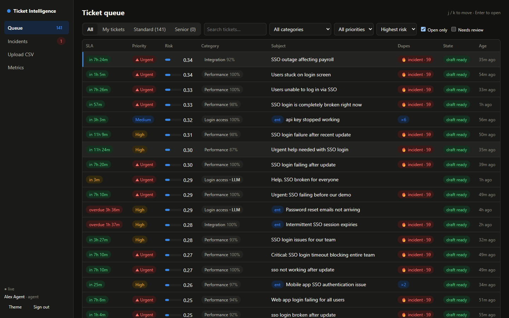
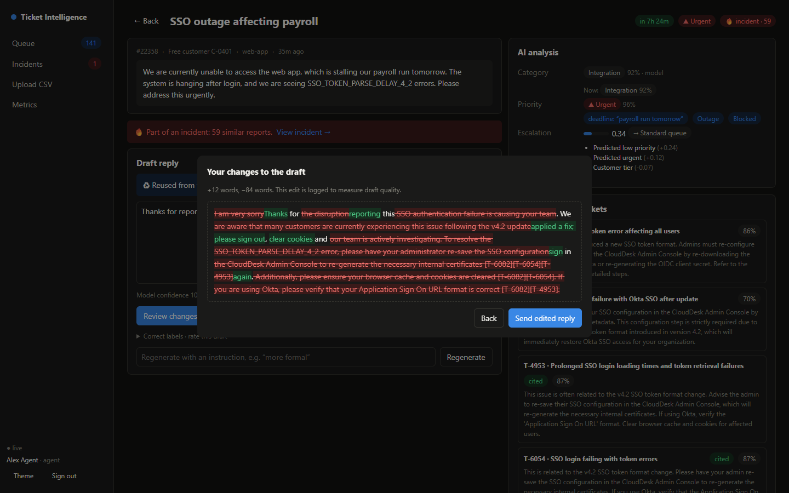
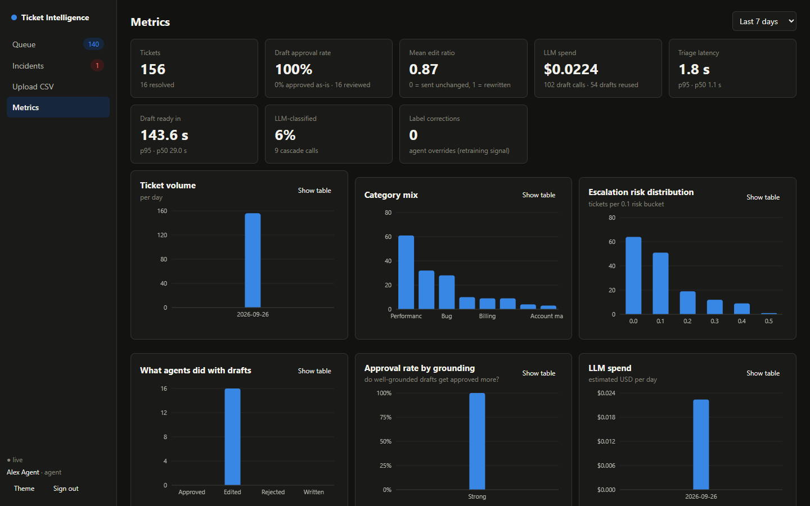

# Support Ticket Intelligence Platform

[](https://github.com/vivektomar0158/ML-Ticket-Intelligence/actions/workflows/ci.yml)

Support teams get thousands of tickets a day. This system does the **first pass** automatically: it classifies each ticket, scores urgency and escalation risk, spots duplicate reports (outages), retrieves similar resolved tickets, and drafts a **grounded, cited reply**. **A human agent approves every reply**, and their edits feed a retraining loop.

Stack: **Spring Boot 4 (Java 17)** orchestration + **FastAPI** ML service + **PostgreSQL/pgvector** + **React/TypeScript** dashboard, with scikit-learn, LightGBM, sentence-transformers and Gemini.



| Agent review: cited draft, AI analysis, explained risk | Outage detected: one shared reply for 59 tickets |
|---|---|
|  |  |

<details><summary>More screenshots</summary>

| Queue | Edit with diff | Metrics |
|---|---|---|
|  |  |  |

</details>

## What it does

```
React dashboard ──► Spring Boot API ──► PostgreSQL + pgvector      (tickets, embeddings, jobs, drafts, feedback)
   (SSE live)            │  job queue (SKIP LOCKED) · dedup · hybrid retrieval · review
                         ├──► Python ML service (FastAPI): classifiers, escalation model, embeddings, AI gateway ──► Gemini
```

| Step | Technique | Where |
|---|---|---|
| Category | MiniLM embeddings + logistic regression (calibrated), Gemini zero-shot for low confidence (cascade) | `ml-service/` |
| Priority | TF-IDF + urgency signals (deadline/outage/error-code) + tier → LR, URGENT threshold tuned for recall | `ml-service/` |
| Escalation risk | LightGBM + Platt calibration, top-3 explanations per ticket | `ml-service/` |
| Duplicates / outages | pgvector kNN + time window + union-find clusters; incident = ≥5 reports, ≥3 customers, 60 min | `api/dedup` |
| Retrieval (RAG) | vector + Postgres full-text, fused with RRF, one hit per duplicate cluster | `api/retrieval` |
| Draft (RAG) | Gemini, JSON output, citations validated against retrieved ids, PII redacted first | `ml-service/app/llm` |
| Async | Postgres job table + `FOR UPDATE SKIP LOCKED`, backoff, reaper, dead-letter | `api/jobs` |

## Results (details and caveats in [`eval/report.md`](eval/report.md))

The data is synthetic, so **read the robustness rows first**; the honest numbers are the interesting part.

| | Result |
|---|---|
| Category macro-F1, issues seen in training | 0.97 |
| Category macro-F1, **genuinely new issue types** | **≈ 0.59–0.60** (both cheap models); the headline 0.97 mostly measures recognising known issues |
| Zero-shot Gemini vs trained model (same 56 tickets) | 0.63 vs 1.00 accuracy; the LLM cannot know this taxonomy's boundaries |
| Escalation ROC-AUC / calibration | 0.73 (ceiling with the generator's hidden inputs: 0.80) / ECE 0.033 |
| Outage detection, held-out period, through the running system | **6/6 detected, 0 false alarms**, ~5 min after the first report |
| Retrieval recall@5 / citation precision (end-to-end) | 0.96 / 0.93 |
| 500-ticket outage burst | fully triaged in 10.8 s; ingest p95 10 ms at steady load |
| Chaos: ML service killed; API hard-killed with 54 jobs in flight | 0 tickets lost, 0 duplicate predictions |
| One shared draft per outage | 59 tickets → ~8 LLM calls instead of 59 |

**Not measured:** Gemini on the unseen-issue regime and LLM-judge draft scores (free-tier quota), and agent approval rate (no real agents). The report's §11 lists every known gap.

## Quick start (about 5 minutes)

The trained models (9 MB) and the dataset (24 MB) are **included**, so it runs straight from a clone.

**Prerequisites:** Docker Desktop (running) and [`uv`](https://docs.astral.sh/uv/) (only used for the small seed script).

```bash
git clone https://github.com/vivektomar0158/ML-Ticket-Intelligence.git && cd ML-Ticket-Intelligence
cp .env.example .env            # Windows cmd: copy .env.example .env
#   add GEMINI_API_KEY to .env for real drafts, or set LLM_PROVIDER=mock to run with no key (template drafts)
docker compose up --build       # first build takes a few minutes; wait until api + ml-service are "healthy"
```

Then, in a second terminal, load the resolved-ticket history (the RAG corpus) and some traffic:

```bash
SEED="uv run --no-project --with httpx --with pandas --with numpy --with pyarrow python scripts/seed.py"
$SEED history                    # 6,164 resolved tickets + embeddings
$SEED incident --speed 0         # replay a simulated SSO outage
$SEED replay --n 150 --no-incidents
```

Open **http://localhost:8081** and sign in as `agent` / `senior` / `admin` (password = username).

- `docker compose --profile observability up` adds Prometheus (:9090) and Grafana (:3000, dashboard provisioned).
- `scripts/reset-live.sh` (Git Bash) clears live tickets and keeps the history.
- The Gemini free tier allows only a few dozen calls per model per day. When it runs out, triage keeps working and drafts show "LLM paused" until the quota resets.

> **Security:** the demo users, the default JWT secret and the default ingest key are for local use only, and the API logs a warning at startup while they are active. Set `JWT_SECRET`, `INGEST_API_KEY`, `ADMIN_KEY` and `SEED_USERS=false` before exposing it.

### Local development (apps outside Docker)

```bash
docker compose up -d postgres
(cd ml-service && uv run uvicorn app.main:app --port 8000)      # LLM_PROVIDER=mock for a key-less run
(cd api && ./mvnw spring-boot:run)                              # Windows cmd: mvnw spring-boot:run
(cd dashboard && npm install && npm run dev)                    # http://localhost:5173 (proxies /api)
```

### Rebuild the data and models from scratch (optional)

The committed artifacts are what this produces. Generating the data needs ~800 Gemini calls (cached and resumable: a free key finishes over a few days, a billing-enabled key in one run).

```bash
# 1. data (repo root; Gemini calls are cached in data/raw/llm_cache and resume after quota resets)
uv run --project ml-service python -m data.generator.root_causes
uv run --project ml-service python -m data.generator.sample_specs
uv run --project ml-service python -m data.generator.generate_tickets --workers 6
mkdir -p data/raw/bitext && curl -L -o data/raw/bitext/bitext.csv "https://huggingface.co/datasets/bitext/Bitext-customer-support-llm-chatbot-training-dataset/resolve/main/Bitext_Sample_Customer_Support_Training_Dataset_27K_responses-v11.csv"
uv run --project ml-service python -m data.generator.prepare_bitext
uv run --project ml-service python -m data.generator.build_dataset
# 2. models + offline evaluation
cd ml-service
uv run python -m training.train_category && uv run python -m training.train_priority && uv run python -m training.train_escalation
uv run python -m training.eval_robustness && uv run python -m training.eval_dedup_retrieval
uv run python -m training.eval_incidents && uv run python -m training.eval_oracle
uv run python -m training.eval_llm_zeroshot --n 120 && uv run python -m training.eval_cascade   # needs Gemini quota
# 3. end-to-end (stack running, history loaded, test split replayed) + report
cd .. && uv run --project ml-service python eval/pipeline_eval.py && uv run --project ml-service python infra/loadtest.py
uv run --project ml-service python eval/build_report.py
```

## Tests

| Suite | Command | Count |
|---|---|---|
| ML service (models, LLM gateway, guards) | `cd ml-service && uv run pytest` | 19 |
| API integration (real pgvector via Testcontainers + fake ML server) | `cd api && ./mvnw test` | 22 |
| Dashboard unit/component | `cd dashboard && npm test` | 26 |
| Browser E2E against the running stack | `cd dashboard && node e2e/smoke.mjs` | 18 checks |
| Chaos on real processes (Git Bash on Windows) | `scripts/chaos.sh` | 9 checks |

The first three run in CI on every push.

## Design decisions

Short ADRs are in [`docs/adr`](docs/adr). The ones worth knowing:

- **Postgres is the queue.** A ticket and its job are committed in one transaction, so nothing is lost between them; no broker to run.
- **Two-stage pipeline.** Predictions in < 2 s regardless of LLM latency; the slow draft stage has its own workers, priority ordering, load shedding, and **one draft per outage** instead of one per ticket.
- **Graceful degradation.** LLM down → triage unaffected, drafts wait and resume. ML service down → tickets accepted, jobs deferred without burning retries.
- **Every LLM call goes through the Python AI gateway** (prompts, PII redaction, caching, cost accounting, model rotation), so offline evaluation runs the same code as production.
- **Explainable by default.** Confidence + source (model / LLM / agent) on every label, top escalation factors, cited source tickets on every draft.

## Layout

```
api/          Spring Boot 4 (Java 17): ingest, jobs, triage, dedup, retrieval, drafts, review, metrics, admin
ml-service/   FastAPI service + training/ (models, evaluation, retraining) + artifacts/ (trained models)
dashboard/    React + TypeScript (Vite): queue, ticket review, incidents, upload, metrics
data/         synthetic-data generator, Bitext prep, data card, processed/ (the dataset)
eval/         evaluation report (report.md), pipeline eval, report builder
infra/        Prometheus / Grafana config, load test
scripts/      seed + replay, reset, chaos
docs/         ADRs, ML service OpenAPI contract, screenshots
```

## Limitations worth stating

- Tickets are LLM-generated; absolute scores are optimistic (quantified in the report).
- Escalation labels come from a known latent function, so its AUC measures recovery of that function, not real-world behaviour.
- The Gemini key used during development was on the free tier; anything needing more than a few dozen LLM calls per model per day was sampled or left unmeasured.
- Single-node deployment; the scale-out path (multiple API replicas are already safe for workers; schedulers would need ShedLock; a broker only if job rates exceed what Postgres handles) is reasoned, not benchmarked.

## License

MIT
