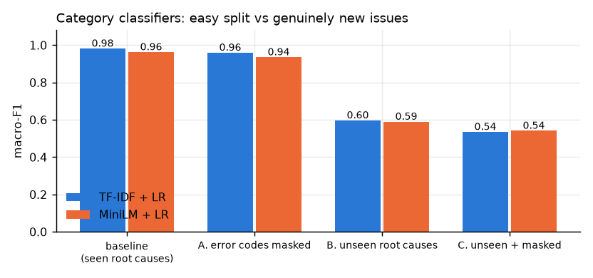
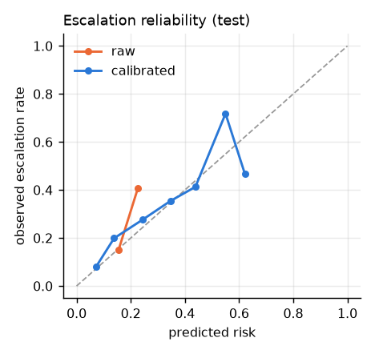
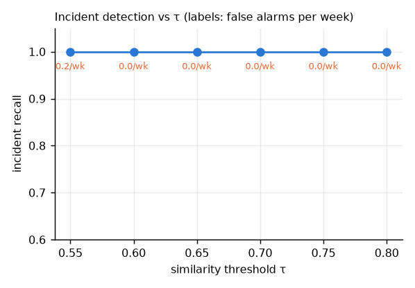
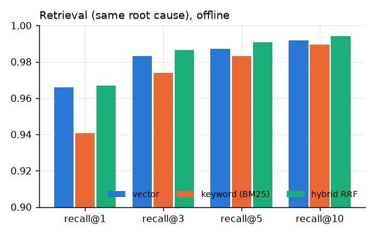

# Evaluation report

Generated 2026-09-26 by `eval/build_report.py` from `eval/metrics/*.json`. Every number below is produced by a script in this repo.

> **Read this first.** The data is synthetic (Gemini-written tickets from known root causes), so absolute scores are optimistic. Section 2 quantifies exactly how optimistic. The Gemini-dependent measurements were run on small samples because the API key is on the free tier (20 requests/day per model on most models); those rows are marked and can be extended by re-running the same scripts after the quota resets.

## 0. Scorecard vs the targets in the plan

| Area | Target | Result | Verdict |
|---|---|---|---|
| Category macro-F1 | ≥ 0.85 | 0.966 (served model, seen issues); 0.590 on unseen issues | met on the standard split; see §2 |
| Priority macro-F1 / URGENT recall | ≥ 0.75 / ≥ 0.90 | 0.720 / 0.80 | **not met** – label-noise ceiling (§4) |
| Escalation ROC-AUC / ECE | ≥ 0.80 / ≤ 0.05 | 0.728 / 0.033 | AUC **not met** – oracle ceiling is 0.801 (§5); ECE met |
| Duplicate / incident detection | pairwise F1 ≥ 0.85 | incidents detected 6/6 end-to-end, 0 false alarms; replay: recall 1.00, median delay 5.4 min | met (metric changed from pairwise F1 to operational, §6) |
| Retrieval recall@5 | ≥ 0.85 | 0.991 offline, 0.957 end-to-end | met |
| Draft groundedness (LLM judge) / agent approval | ≥ 4/5 / ≥ 70% | **not measured** | quota (judge) and no real agents; harness exists (§8) |
| Ingest p95 / triage p95 (normal load) | < 50 ms / < 2 s | 10.1 ms / 425.7 ms | met |
| 500-ticket burst fully triaged | < 60 s | 10.8 s | met |
| Draft ready p95 | < 15 s | 0.82 s steady, 11.3 s burst (stub LLM, excludes real Gemini latency) | met for the stub; see §9 |

## 1. Data

See `data/DATA_CARD.md`: 7,888 synthetic tickets (train 5,329 / val 835 / test 1,724, split by time), 120 root causes, 15 simulated outages. Bitext (26,872 utterances, 11 categories) is used as an external benchmark.

## 2. Category classification: the model-vs-LLM table

Standard test split (issues seen in training). Latency is per ticket, warm, end-to-end (embedding included for the embedding models); cost is per 1,000 tickets.

| Approach | Macro-F1 | Accuracy | ECE | Latency p50 (batch 1) | Batch of 32 | Cost / 1K tickets |
|---|---|---|---|---|---|---|
| TF-IDF + logistic regression | 0.982 | 0.977 | 0.092 | 1.7 ms | 0.4 ms/ticket | ≈ $0 |
| MiniLM embedding + logistic regression **(served)** | 0.966 | 0.958 | 0.009 | 14.9 ms | 9.3 ms/ticket | ≈ $0 |
| MiniLM embedding + MLP | 0.971 | 0.965 | 0.014 | – | – | ≈ $0 |
| Gemini zero-shot (**n = 56 sample**, not the full test set) | 0.397* | 0.625 | – | 1.31 s (p95 4.73 s) | – | $0.062 (assumed price) |

\* macro-F1 on 56 tickets over 8 classes is unreliable; compare accuracy. On the same 56 tickets the served embedding model scores accuracy 1.000 vs Gemini 0.625.

On this synthetic taxonomy zero-shot Gemini is clearly worse than a model trained on the labels: category boundaries here are set by the data (e.g. an API 403 filed under LOGIN_ACCESS), which a zero-shot prompt cannot know.

**Why TF-IDF is not the served model even though its F1 is higher:** its probabilities are badly calibrated (ECE 0.092 vs 0.009), so its confidence cannot drive the cascade threshold; and under unseen issues the two are tied (below).

### How optimistic is the standard split? (robustness checks)

The error codes in the generated tickets leak the root cause, and every test issue also appears in training. Two stress tests:

| Scenario | TF-IDF + LR | MiniLM + LR | Train / test size |
|---|---|---|---|
| baseline (seen root causes) | 0.982 | 0.963 | 5329 / 1724 |
| A. error codes masked | 0.960 | 0.936 | 5329 / 1724 |
| B. unseen root causes | 0.597 | 0.590 | 4435 / 1384 |
| C. unseen + masked | 0.535 | 0.542 | 4435 / 1384 |

**Takeaway:** the headline 0.97 mostly measures recognising known issues. Facing a genuinely new issue type both cheap models fall to ≈ 0.6. That is exactly the situation the LLM fallback exists for, and it is the number to quote in an interview, not 0.97.

### Cascade (cheap model first, LLM when confidence < τ)

Evaluated on the 56-ticket Gemini sample (standard split). Confidence is informative only when the model is ever unsure: 0 of 56 tickets had confidence < 0.6.

| τ | % sent to LLM | accuracy | cost / 1K | mean latency |
|---|---|---|---|---|
| 0.00 | 0% | 1.000 | $0.000 | 14.9 ms |
| 0.30 | 0% | 1.000 | $0.000 | 14.9 ms |
| 0.40 | 0% | 1.000 | $0.000 | 14.9 ms |
| 0.50 | 0% | 1.000 | $0.000 | 14.9 ms |
| 0.60 | 0% | 1.000 | $0.000 | 14.9 ms |
| 0.70 | 0% | 1.000 | $0.000 | 14.9 ms |
| 0.80 | 0% | 1.000 | $0.000 | 14.9 ms |
| 0.90 | 7% | 0.946 | $0.004 | 152.4 ms |
| 0.95 | 7% | 0.946 | $0.004 | 152.4 ms |
| 1.01 | 100% | 0.625 | $0.062 | 1.94 s |

Unseen-issue regime: pending: no Gemini results (free-tier quota); rerun eval_llm_zeroshot after reset. **Decision recorded:** serve the calibrated embedding classifier, escalate to Gemini below confidence 0.80 (config `confidence_threshold`). On seen issues the cascade cannot help (the LLM is worse than the cheap model); its value is unproven until the unseen-regime Gemini run completes.

### External benchmark (Bitext, 11 categories)

TF-IDF + LR macro-F1 1.000, MiniLM + LR 0.997. Bitext utterances are template-generated (~9 words), so this saturates and only shows the pipeline is sound.

Augmenting training with 3000 Bitext-mapped utterances: macro-F1 0.9662 → 0.9637; kept = False (domain mismatch: 9-word e-commerce utterances vs 45-word SaaS tickets).

### Per-class F1 (served model, test)

| Class | Precision | Recall | F1 | Support |
|---|---|---|---|---|
| ACCOUNT_MANAGEMENT | 0.97 | 0.99 | 0.98 | 155 |
| BILLING | 0.99 | 1.00 | 1.00 | 220 |
| BUG | 0.95 | 1.00 | 0.97 | 311 |
| DATA_PRIVACY | 0.99 | 0.98 | 0.99 | 118 |
| FEATURE_REQUEST | 1.00 | 0.99 | 1.00 | 120 |
| INTEGRATION | 0.86 | 0.93 | 0.90 | 230 |
| LOGIN_ACCESS | 0.97 | 0.88 | 0.92 | 381 |
| PERFORMANCE | 0.99 | 0.96 | 0.98 | 189 |

## 4. Priority

TF-IDF + urgency signals (deadline / outage / error-code / sentiment) + tier → logistic regression. Macro-F1 0.720, accuracy 0.711. URGENT recall 0.77 (precision 0.75); with the URGENT decision weight tuned on validation (w = 1.25): recall 0.80 / precision 0.72. Tickets predicted ≥ 2 levels too low: 0.011.

Ablation: text only 0.725 vs with hand-crafted signals + tier 0.720: the engineered features add nothing over TF-IDF here (they are largely expressed in the text already).

**Why the target is missed:** the generator adds label noise (12% random ±1 priority shifts) and a deadline effect that is only sometimes visible in the text, so there is an irreducible error floor. I did not tune on the test set to hide this.

## 5. Escalation risk

LightGBM on urgency signals + embedding PCA(32) + predicted category/priority probabilities + metadata (tier, product, hour, weekday, off-hours, customer's tickets in the last 7 days, similar-reports-in-3h cluster size), Platt-calibrated on validation.

| Metric | Value |
|---|---|
| ROC-AUC | 0.728 (logistic-regression baseline 0.735) |
| **Ceiling** (model given the generator's true hidden inputs) | 0.801 |
| PR-AUC | 0.394 (base rate 0.197) |
| Brier raw → Platt → isotonic | 0.1514 → 0.1422 → 0.1413 |
| ECE raw → Platt → isotonic | 0.0383 → 0.0331 → 0.0290 |

**Honest reading:** labels come from a *logistic* latent function, so a plain logistic regression matches LightGBM; the AUC target of 0.80 equals the oracle ceiling and was unreachable from text alone. Calibration helps measurably (Brier and ECE both drop). Top features: p_pri_LOW, prior_tickets_7d, tier, p_pri_URGENT, p_pri_HIGH, p_pri_MEDIUM.

Routing (calibrated risk ≥ θ → senior queue), test split:

| θ | routed to senior | precision | recall |
|---|---|---|---|
| 0.2 | 27% | 0.37 | 0.51 |
| 0.3 | 17% | 0.43 | 0.36 |
| 0.4 | 8% | 0.50 | 0.21 |
| 0.5 | 3% | 0.65 | 0.10 |
| 0.6 | 1% | 0.47 | 0.02 |
| 0.7 | 0% | n/a | 0.00 |
| 0.8 | 0% | n/a | 0.00 |

Served threshold θ = 0.4 (≈ 8% of tickets to the senior queue, precision ≈ 2.5× the base rate).

## 6. Duplicate and incident detection

Pairwise precision/recall is the wrong yardstick (many tickets are legitimately similar without being an outage), so detection is evaluated operationally: replay the timeline through the production logic (link to earlier same-product tickets with cosine ≥ τ inside a window, flag an incident at ≥ 5 tickets from ≥ 3 customers in 60 min).

| τ | window | incident recall | median delay (min) | false alarms / week |
|---|---|---|---|---|
| 0.55 | 3 h | 1.00 | 5.5 | 0.20 |
| 0.6 | 3 h | 1.00 | 5.5 | 0.00 |
| 0.65 | 3 h | 1.00 | 4.8 | 0.00 |
| 0.7 | 3 h | 1.00 | 4.4 | 0.00 |
| 0.75 | 3 h | 1.00 | 5.6 | 0.00 |
| 0.8 | 3 h | 1.00 | 7.0 | 0.00 |
| 0.55 | 72 h | 1.00 | 4.8 | 10.25 |
| 0.6 | 72 h | 1.00 | 4.8 | 2.07 |
| 0.65 | 72 h | 1.00 | 5.5 | 0.59 |
| 0.7 | 72 h | 1.00 | 5.6 | 0.00 |
| 0.75 | 72 h | 1.00 | 5.6 | 0.00 |
| 0.8 | 72 h | 1.00 | 5.6 | 0.00 |

Chosen on days 0–72: τ = 0.7, window 3 h. Held-out days 72–90: 6/6 incidents detected, median delay 5.4 min (5 tickets), 0 false alarms.

Key finding that shaped the design: same-incident pairs have median cosine 0.74 but *recurring* same-root-cause tickets weeks apart score 0.83, so a similarity threshold alone cannot separate them: the **time window** is what makes it work. (A units bug in my first window computation inflated false alarms to ~100/week; it was found by inspecting the flagged clusters and fixed.)

**End-to-end through the running system** (1,724 held-out tickets replayed via the API):

| Incident | tickets | in main cluster | member recall | cluster purity | flagged |
|---|---|---|---|---|---|
| INC-01 | 56 | 49 | 0.88 | 0.79 | yes |
| INC-08 | 31 | 27 | 0.87 | 1.00 | yes |
| INC-11 | 27 | 26 | 0.96 | 1.00 | yes |
| INC-12 | 55 | 49 | 0.89 | 0.92 | yes |
| INC-13 | 39 | 36 | 0.92 | 0.97 | yes |
| INC-14 | 42 | 39 | 0.93 | 1.00 | yes |

Detected 6/6, mean member recall 0.91, mean purity 0.95, false incident flags 0.

## 7. Retrieval (RAG, retrieval half)

Queries = test tickets; corpus = resolved history; relevant = same root cause.

| Method | recall@1 | recall@3 | recall@5 | recall@10 | MRR |
|---|---|---|---|---|---|
| Vector (pgvector cosine) | 0.966 | 0.983 | 0.987 | 0.992 | 0.976 |
| Keyword (BM25, proxy for Postgres FTS) | 0.941 | 0.974 | 0.983 | 0.990 | 0.959 |
| Hybrid (RRF) | 0.967 | 0.987 | 0.991 | 0.994 | 0.978 |

Through the real Java retriever on 1437 drafted tickets: hit@1 0.933, hit@5 0.957, MRR 0.942; **citation precision 0.933** (the cited ticket shares the true root cause). End-to-end is a little lower than offline because of the one-per-duplicate-cluster diversity rule and burst conditions.

Caveat: every test root cause also exists in the history, so this is the *easy* retrieval case; a new issue type has nothing relevant to retrieve, which is what the `NONE` grounding path handles (the draft asks questions instead of inventing a fix).

## 8. Draft quality

- **Structural guarantees (tested):** citations are validated against the retrieved set; hallucinated ids are stripped, confidence capped and grounding downgraded; PII is redacted before text leaves for Gemini; `NONE` grounding switches the prompt to ask-questions-only.

- **Grounding coverage:** 1437 drafts, citation precision 0.933.

- **LLM-judge groundedness/correctness (1–5): not measured.** The harness exists (`/v1/llm/judge` + `judge_v1` prompt) but the free-tier quota was exhausted before a judged sample could run; these were not replaced with made-up numbers. **Agent approval / edit rate:** the review loop is implemented and logged (edit ratio, reject reasons, rating), but there were no real agents; the metrics page shows the live values.

- Draft texts in the end-to-end runs above came from the deterministic stub LLM (grounded template), so they validate retrieval, citation and plumbing, not Gemini's writing quality.

## 9. System behaviour

Load test (`infra/loadtest.py`; local laptop, single instance of each service, stub LLM):

| Scenario | Tickets | Ingest | Triage p50 / p95 | Draft p50 / p95 | Drained after |
|---|---|---|---|---|---|
| Steady 2.0/s | 90 | p50 8.2 ms, p95 10.1 ms | 0.22 / 0.43 s | 0.45 / 0.82 s | 0.9 s |
| Outage burst | 500 | 208 tickets/s | 4.1 / 8.1 s | 6.7 / 11.3 s | 13.2 s |

Heavy burst (1,724 tickets in 16 s ≈ 100/s, 10× the design point): everything eventually processed; triage p95 35 s (queueing). Load shedding correctly skipped drafts for low-value tickets (287 of 1724); 222 drafts were reused from incident canonical drafts (LLM calls saved).

**Real-Gemini caveat:** with real Gemini each draft takes ~1–5 s and is rate-limited, so with 3 draft workers a 500-ticket burst would take minutes, not seconds. That is what incident draft reuse, load shedding and priority ordering are for; it was not load-tested with the live API.

Chaos (`scripts/chaos.sh`, real processes): ML service killed under load → ingestion stayed fast and lossless (40/40 accepted in 1.6 s), 0 dead jobs, all triaged after recovery; API hard-killed with 54 jobs mid-flight → 190/190 tickets stored and drafted, 0 duplicate predictions, exactly one active draft per ticket. Also covered by integration tests: LLM outage (drafts wait, triage unaffected, recovery), ML outage (deferred without consuming attempts), 300 jobs claimed exactly once by 8 concurrent workers, crashed-worker reaper.

## 10. Feedback loop and retraining

Demonstration on the live system: 14 agent-corrected tickets (+ probe) exported → candidate trained → frozen-test macro-F1 0.9662 → 0.9687, worst per-class drop 0.009 → gate passed → promoted and hot-reloaded into the running ML service without a restart. The recent-traffic probe had only 5 tickets, so it demonstrates the mechanism, not an accuracy gain.

Promotion gate: macro-F1 on the frozen test set ≥ current − 0.005 and no class F1 drop > 0.03. A drift monitor compares the last 7 days with the previous 30 (share of low-confidence tickets, category-mix shift) and logs an alert.

## 11. What was not done / known gaps

- Gemini zero-shot on the unseen-issue regime and on the full test set; LLM-judge draft scoring (free-tier quota).
- Cross-encoder rerank ablation, HNSW `ef_search` tuning and LISTEN/NOTIFY worker wake-ups (hybrid retrieval already reaches recall@5 ≈ 0.99 on this data; polling is 50–200 ms).
- Load-shedding is covered by design and observed in the burst run, but has no dedicated automated test.
- Playwright: the browser E2E uses puppeteer-core with DOM-dispatched events because real CDP mouse/keyboard input did not reach the app pages in this headless setup (root cause not found; unit tests with userEvent cover real pointer and keyboard paths).
- Priority/escalation models are not part of the automated retrain script (category only).
- Single-node Postgres/JVM; horizontal scaling story is described in the README but not exercised.
